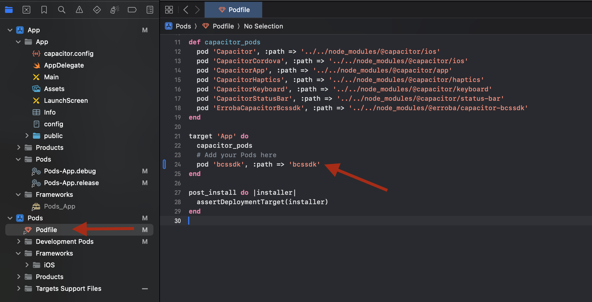

id: bcs-face-ionic

# Como usar BCS en IONIC

## Introducción

En la siguiente guía vamos a ver como integrar el módulo de verificación de identidad de BCS en IONIC.

Para poder hacer esto vas a necesitar tener que tener configurado tu entorno para desarrollo IONIC.

Podes itilizar cualquier IDE, vamos a hacer todo x linea de comandos, para la versión de iOS es necesaria una Mac y XCode.


## Plugin

Para poder usar BCS en tu proyecto de IONIC necesitas ejecutar los siguientes comandos:

```
npm install @erroba/capacitor-bcssdk
npx cap sync
```

Adicionalmente necesitamos agregar unas dependencias nativas que no pueden agregarse en el plugin.

* Android: archivo bcssdk.1.x.x.aar
* iOS: bcssdk.xcframework

Los mismos son provistos al equipo de desarrollo por erroba.

## Permisos
La verificación de identidad con rostro necesita algunos permisos en el dispositivo:
* Cámara
* Micrófono (solo android)

El SDK los solicita, pero si son denegados obtendras la respuesta `PERMISSIONS_ERROR`.
<aside class="negative">
Si los permisos son denegados multiples veces la aplicación ya no mostrara la solicitud, este es el comportamiento natural tanto en Android como en iOS, una práctica habitual es abrir la configuración de la APP para que el usuario lo habilite.
</aside>

### Android

En Android no necesitas editar el archivo AndroidManifest.xml, el plugin agrega lo necesario.

### iOS

En iOS hay que hacer unos ajustes en el proyecto APP de  iOS.

Debes agregar la entrada de `NSCameraUsageDescription` a tu `Info.plist`

```xml
<key>NSCameraUsageDescription</key>
<string>Es necesario el uso de la cámara.</string>
```

## Librerias nativas - Android

Primero vamos a copiar algunas librerias nativas que son necesarias que funcione el proyecto.

1. Copia el archivo `bcssdk-x.x.x.aar` a la carpeta `android/app/libs`
2. Edita el archivo `android/app/build.gradle` y agrega la dependencia `implementation files('libs/bcssdk-1.x.x.aar')`:

Debería quedarte algo así:


## Librerias nativas - iOS

Para iOS es necesario referenciar el bcssdk.xcframework en el proyecto APP de Xcode.

1. Abre la APP con Xcode, puede ejecutar el comando: `ionic cap open ios`
2. Referencia el framework bcssdk.xcframework (lo puedes arrastrar desde finder a la carpeta Frameworks de xcode y elige la opcion copy files)
3. En la configuración general de APP, chequea que el framework este referenciado y este como "Embed & Sign":



4. En Build Phases, en la seccion de "Copy Bundle Resources", agrega "bcssdk.xcframework"


## Utilización del cliente

A continuacion vamos a mostrar el uso suponiendo que ya tenemos un código de transacción para verificar.

### Verificación

Ya tenemos todo configurado, vamos a usar el cliente!

Para llamar a la verificación solo tenes que llamar la función `bcsPlugin.faceVerify({ code: 'AQUI_CODIGO' })`, la función es asincrónica, debes obtener el resultado con `await`

```typescript
bcsPlugin: BCSSDKPlugin = BCSSDK;

async processVerify() {
	try {
	  const response = await this.bcsPlugin.faceVerify({ code: this.code });
	  this.result = response.result;
	} catch (err: any) {
	  this.result = 'Error: ' + (err?.message || JSON.stringify(err));
	}
}
```

### Respuestas

La respuesta de la llamada a `faceVerify` es un string y puede ser uno de los siguientes valores:

* DONE
* CANCELED
* PERMISSIONS_ERROR
* CONNECTION_ERROR
* TRANSACTION_NOT_FOUND


> Según la respuesta obtenida es la acción que debes realizar en tu app.

#### DONE

La operación finalizó en el servidor, debes obtener el resultado desde tu backend, puede ser tanto Verificado como NO verificado.

#### CANCELED

El usuario canceló la operación, generalmente con la opción o gesto de volver.

#### PERMISSIONS_ERROR

Esta respuesta se da cuando no hay permisos para cámara y microfono, debes haberlos solicitado antes y verificarlos.

#### CONNECTION_ERROR

No fue posible conectar con los servidores de BCS, puede deberse a un problema de conectividad entre el dispositivo e internet/servidores de BCS.

#### TRANSACTION_NOT_FOUND

No se encontró la transacción x el identificador `code`. Ten en cuenta que después de creada solo puede ser procesada en un período corto de tiempo.

## Estilos

La interfaz de la verificación es minimalista, el único control de interacción con el usuario es un botón para `Reintentar` la operación.

Podes establecer los colores para los controles llamando a la función `setColors` del plugin.

```typescript
async initializePluginColors() {
    const primary = '#6200ee'; // Define tus colores
    const onPrimary = '#ffffff';
    try {
      await this.bcsPlugin.setColors({ primary, onPrimary });
    } catch (err) {
      console.error('Error setting colors:', err);
    }
}
```

## Ambiente QA/Docker

Por defecto el cliente utiliza el ambiente productivo. Si deseas usar al ambiente de calidad o desarrollo con docker podes cambiar la URL de los servicios.

Para hacerlo está disponible la función `setUrlService` en la api.

```typescript
await this.bcsPlugin.setUrlService({ url: 'https://bas.develop.ex-cle.com' });
```

> No dejes este código en el RELEASE de tu aplicación.

## Servicio BCS

Para utilizar la verificación, previamente debes haber generado un código de transacción desde el backend de tu aplicación.


>Es recomendable NO exponer en tus APIS la identificación de la persona, sino hacerlo sobre algún identificador de onboarding o transacción. De esta froma podés prevenir el uso de tu API por terceros.


